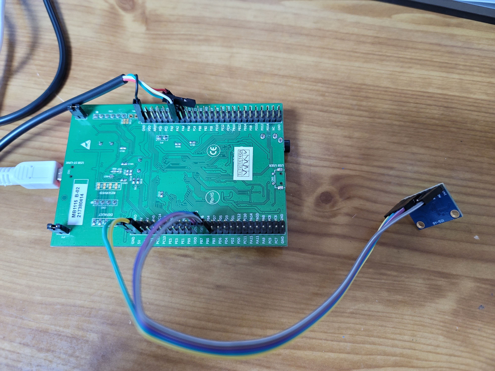

# MPU6050 with STM32

This is a step by step approach to get sensor data from MPU6050.


# Supplies
-Any STM32 board(I used STM32F411 discovery board)

-GY-521



# Procedure
When the data get ready, INT Pin of GY-521 will be latched(active high).

In the while loop, you will constantly check INT Pin status.

And if INT Pin latched, you will get 6 axis data from register.

# PIN Connection

## GY-521
```
VCC - 5V
GND - GND
SDA - PB7
SCL - PB6
INT - PB5
```

# IOC Setup
Start and initialize the I2C bus.


Activate PB5 as GPIO_Input to check INT Pin status from GY-521


See the Project Manager and Check the check box like this.


Check that you are using HAL driver for I2C.


Generate code by pressing CTRL+S.

# Code Setup

Copy the (MPU6050.c, MPU6050.h) to (Src, Inc) respectively.


In the main.c file, include header file.
```
/* USER CODE BEGIN Includes */
#include "MPU6050.h"
/* USER CODE END Includes */
```


Initialize MPU6050 sensor inside in between USER CODE 2
  ```
  /* USER CODE BEGIN 2 */
  MPU6050_Initialization();
  /* USER CODE END 2 */
  ```
 
 
When data is ready, Get sensor data!

```
  /* USER CODE BEGIN WHILE */
	while (1)
	{
    /* USER CODE END WHILE */

    /* USER CODE BEGIN 3 */
		if(MPU6050_DataReady() == 1)
		{
			MPU6050_ProcessData(&MPU6050);
			//printf("%f, %f, %f\n", MPU6050.acc_x, MPU6050.acc_y, MPU6050.acc_z);
			//printf("%f, %f, %f\n", MPU6050.gyro_x, MPU6050.gyro_y, MPU6050.gyro_z);
			printf("%d, %d, %d\n", MPU6050.acc_x_raw, MPU6050.acc_y_raw, MPU6050.acc_z_raw);
		}
	}
  /* USER CODE END 3 */
}
```

When 'MPU6050_ProcessData(&MPU6050);' function excuted, data will be stored in structure.

you can see a definition of the structure in the MPU6050.h file.

```
typedef struct _MPU6050{
	short acc_x_raw;
	short acc_y_raw;
	short acc_z_raw;
	short temperature_raw;
	short gyro_x_raw;
	short gyro_y_raw;
	short gyro_z_raw;

	float acc_x;
	float acc_y;
	float acc_z;
	float temperature;
	float gyro_x;
	float gyro_y;
	float gyro_z;
}Struct_MPU6050;
```


you can get sensor data like this.


## P.S.1
To use 'printf' you need to activate USART port.


Add this code to use USART2
```
/* USER CODE BEGIN PTD */
int _write(int file, uint8_t* p, int len)
{
	if(HAL_UART_Transmit(&huart2, p, len, len) == HAL_OK )
	{
		return len;
	}
	return 0;
}
/* USER CODE END PTD */
```

## P.S.2
I recommand you not to use bluepill board if it uses fake chip.

I tried with 3 different fake bluepill board. but all of the attempt failed.


